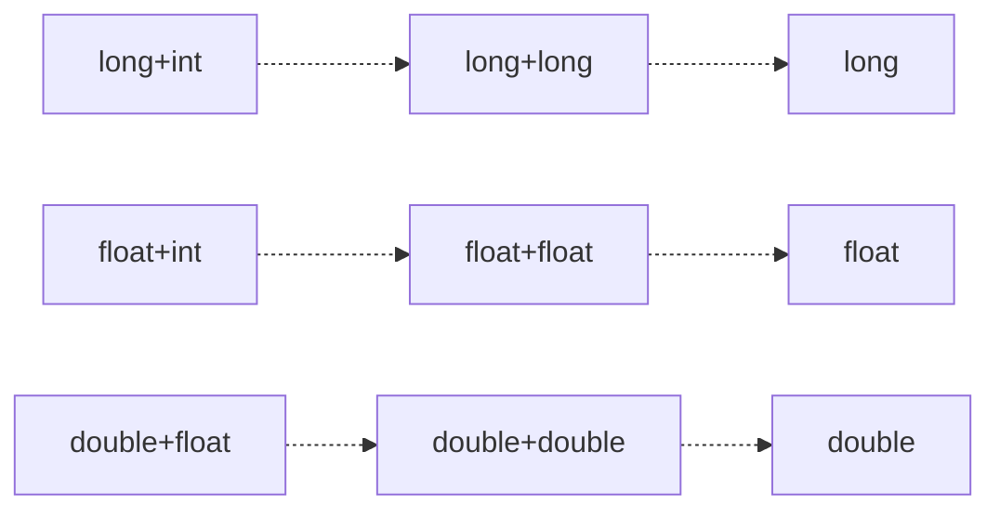
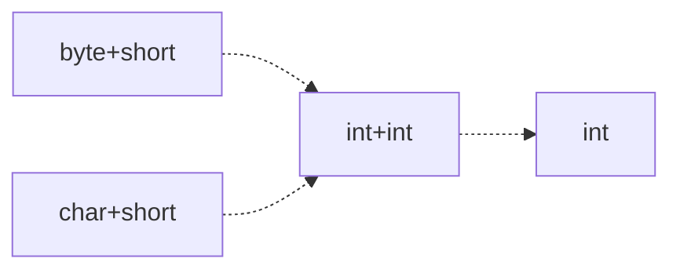
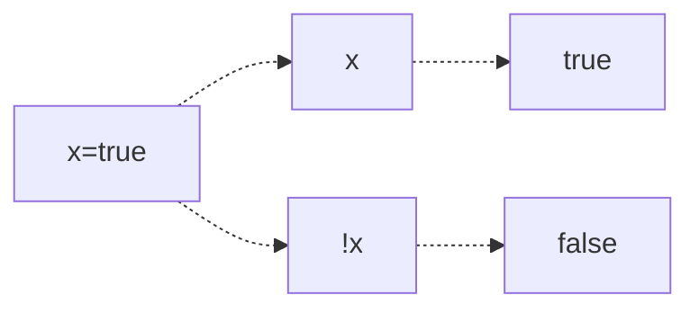
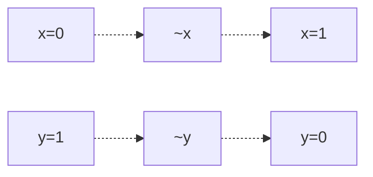

## 연산자

- 연산을 수행하는 기호
- 자바에서는 사칙연산을 비롯해 많은 연산자들을 제공한다.

---

### 연산자와 피연산자

- 연산을 수행하려면 **연산의 대상이 있어야 한다**. 그 대상을 '피연산자(operand)'라고 한다.
- 연산자 : 연산 수행 기호(사칙연산 등)
- 피연산자 : 연산자의 작업 대상(변수, 상수, 리터럴, 수식)

---

### 연산자의 종류

|    종류     |        연산자        | 설명                                        |
| :---------: | :------------------: | ------------------------------------------- |
| 산술 연산자 |  \+ - \* / % << >>   | 사칙 연산과 나머지 연산                     |
| 비교 연산자 |   \> < >= <= == !=   | 크기 비교                                   |
| 논리 연산자 |  && \|\| ! & \| ^ ~  | AND와 OR으로 조건 연결                      |
| 대입 연산자 |          \=          | 우변의 값을 좌변에 저장                     |
|    기타     | (type) ?: instanceof | 형변환 연산자, 삼항연산자, instanceof연산자 |

연산자의 기능별로 분류를 한 표다.  
이 중에 낯익은 연산자들을 많이 볼 수 있지만, 아직 익숙하지 않거나 처음 보는 연산자들이 있었다.  
그러한 연산자들은 공부하면서 알아볼 예정이다.

---

### 연산자의 우선순위

연산자를 식에 사용을 할 경우, 두 개 이상을 사용할 경우가 종종 있다. 이런 경우, 연산자의 우선순위에 따라 연산순서가 결정된다.

1.  산술 > 비교 > 논리 > 대입 순으로 연산
2.  단항 > 이항 > 삼항
3.  **단항 연산자와 대입 연산자를 제외**한 모든 연산자의 **진행방향은 왼쪽에서 오른쪽**

---

### 산술 변환(usual arithmetic conversion)

#### 산술 변환이란

- 연산 수행 직전에 발생하는 **피연산자의 자동 형변환**

#### 산술 변환의 규칙

- 두 피연산자의 타입을 같게 일치시킨다. (큰 타입으로 일치)



- 피연산자의 타입이 int보다 작은 타입일 경우 int로 변환



---

## 연산자 종류

### 단항 연산자

#### 증감 연산자(++, --)

- 증감 연산자는 피연산자 저장된 값을 1을 증가나 감소시킨다.  
  `증가 연산자(++) - 피연산자의 값을 1 증가`  
  `감소 연산자(--) - 피연산자의 값을 1 감소`  
  단항연산자는 피연산자의 양쪽에서 모두 사용 가능하다.  
  하지만 위치에 따라 계산 방식이 달라진다.

|  타입  | 설명                  |   예시   |
| :----: | --------------------- | :------: |
| 전위형 | 값이 참조되기 전 증가 | j = ++i; |
| 후위형 | 값이 참조된 후 증가   | j = --i; |

---

### 논리 연산자

#### 논리 연산자 - (&&, ||, !)

- 논리 연산자는 둘 이상의 조건을 AND나 OR로 연결하여 하나의 식으로 표현할 수 있게 해 준다.  
  `|| (OR) - 피연산자 중 한쪽만 true이여도 true`  
  `&&(AND) - 피연산자 모두 true이어야 true`

#### 논리 부정 연산자 - (!)

피연산자 앞에 사용할 경우 피연산자의 반대값을 반환한다.



#### 비트 연산자 - (&, |, ^, ~, <<, >>)

- 비트 연산자는 피연산자를 비트단위로 논리 연산한다.  
  `| (OR) - 피연산자 중 한 쪽만 1 이어도 1을 결과로 얻는다. 그 외 0`  
  `& (AND) - 피연산자 모두 1이어야 1을 결과로 얻는다. 그 외 0`  
  `^ (XOR) - 피연산자의 값이 서로 다른 경우에만 1을 결과로 얻는다. 같을 경우 0`

#### 비트 전환 연산자 - (~)

- 피연산자를 2진수로 표현했을 때, 0은 1로, 1은 0으로 바꾼다. 논리 부정 연산자와 유사



---

### 그 외

#### 조건 연산자 - (? :)

- 삼항 연산자로 첫 번째 조건식이 참인지 거짓인지에 따라 다른 결과를 반환할 수 있다.

```java
조건식 ? 식1 : 식2
// 조건식이 참이면 식1을 반환
// 거짓이면 식2를 반환
```

#### 대입 연산자 - (=, op=)
