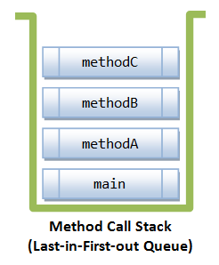

## 호출 스택

- 스택(stack)
  - 스택의 사전 정의는 '쌓다'로 **접시처럼 쌓아놓은 것**을 의미한다.
- 호출 스택(call stack)
  - 메소드 수행에 필요한 메모리가 저장되는 공간
  - 메소드 호출 ->호출스택에 메모리 할당, 종료 -> 해제
  - 아래 메소드가 다음 메소드를 호출하면 다음 메소드가 쌓인다.
  - 메소드가 쌓이게 되면 맨 위 메소드가 실행되고 나머지는 대기한다.


<br/>
위 이미지로 봤을 때는


이런 식으로 <ins>Last-in-First-out</ins>(마지막으로 들어오면 첫 번째로 나감) 큐로 볼 수 있다.

## 메소드 오버로딩(Method overloading)

**메소드 오버로딩**이란 하나의 클래스 안에 **같은 이름의 메소드를 여러 개**를 정의해서 **다양한 상황에서 사용**하는 것

### 오버로딩 성립조건

1. 메소드 이름이 같아야 한다.
2. 매개변수의 개수나 타입이 달라야 한다.
3. 반환 타입에 영향이 없다.

## 생성자

인스턴스가 생성될 때마다 호출되는 '인스턴스 초기화 메소드'
인스턴스 생성 시 수행할 작업(인스턴스변수 초기화)에 사용
이름이 클래스 이름과 동일해야 한다.

## this(), this

표기한 것과 같이 this()와 this는 다른 것이다.

- this
  - **인스턴스 자신을 가리키는 참조변수**, 인스턴스의 주소가 저장되어 있다.
  - 모든 인스턴스 메소드에 지역변수로 숨겨진 채로 존재한다.
- this(), this(매개변수)
  - **생성자, 같은 클래스의 다른 생성자를 호출할 때** 사용된다.

## 변수의 초기화

- 지역변수는 **사용하기 전**에 **반드시 수동 초기화**를 해야 한다.

> 멤버변수(클래스변수와 인스턴스변수)와 배열의 초기화는 선택적이지만, 지역변수 초기화는 필수다.
{: .prompt-info }

### 멤버변수의 초기화

- 멤버변수의 초기화 방법

1. 명시적 초기화

```java
class Car {
	int door = 4; // 기본형 변수 초기화
	Engine e = new Engine(); // 참조형 변수 초기화
}
```

2. 초기화 블록(복잡한 블록의 초기화에만 사용)<br/>
   IV(Instance Variable) : `인스턴스 초기화 블록 : {}`<br/>
   CV(Class Variable) : `클래스 초기화 블록 : static {}`
3. 생성자 - IV 초기화

- 멤버변수의 초기화 시점
  - 클래스 변수 : 클래스가 처음 로딩될 때 한 번
  - 인스턴스 변수 : 인스턴스가 생성될 때마다
